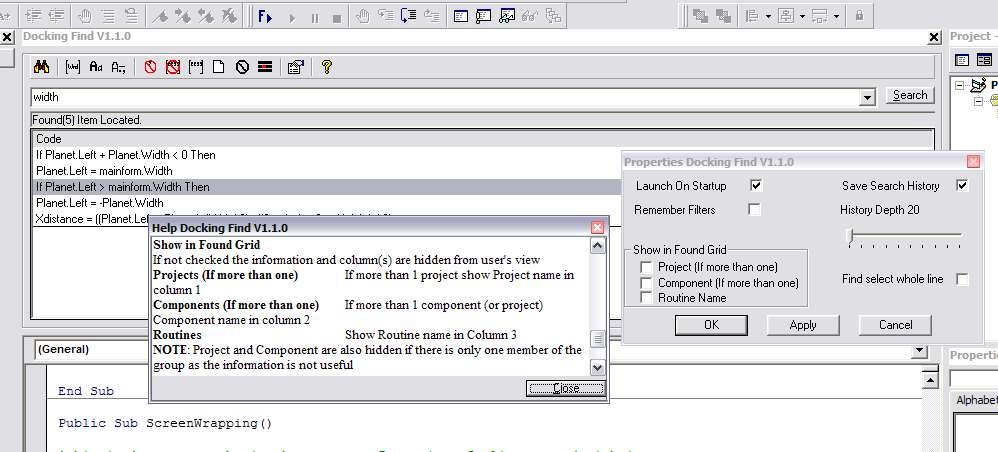



## Extended Find ver 1\.1

### Description

Ver1.1.03

general tightening of code. Help file now has details of pattern searching and added optional gridlines for found box.

Ver1.1.02

Now has pattern searching! Screen shot slightly out of date, have added better button graphics(on/off states), also fixed the bug in ver1.1.1 where first line of found overwrote the headings.

Ver 1.1.1

Lots of new stuff (see Ver data at end of description)

ver 1.1 uses grid tool instead of listbox to display finds. This is a re-write of my earlier Find Add-in using a UserDocument. Mostly just an experiment for a conversion of my Code Fixer. You can search for whole words, parts of words, case sensitive or insensitve, punctuation aware, ignore comments and strings or only find strings and restrict to current code page of code. Once launched you can also search for new items simple by selecting the word in code and pressing a button. Added settings screen which allows you to launch Tool on VB startup, save previous searches and filter settings between runs, set limits (20-400) on search history. For add-in programmers check the code around PasteFace command for a solution to the problem of destroying the clipboard contents when using this

command and just below it the disgustingly simple way to make add-ins appear during VB startup sequence. To use Open project in VB, compile(placing dll in VB folder or where ever you normally store add-ins), close and re-start VB, in Add-ins menu select 'Add-in Manager..' look for 'ExFind_D' set 'Loaded/Unloaded' and 'Load on

Startup' (NOTE this is NOT same as the 'Launch On

Startup' setting within the program.)

Version 1.1.01

The Status label has been removed; report on activity now appears in the Code column heading.

Added a 'Clear History' button to Properties page. (also changed layout of form)

Rearranged the toolbar buttons for more clarity

Changed All/Current Code page button to toggle mode.

Improved the shut down process to properly remove all forms/objects.

Changed the way settings are stored to overcome problem with Registry storing boolean data on non-Engish Systems.

Moved all Property load/save code into just 2 routines. (NOTE Property and Help form positions are saved separately by each form)

Adjusted the Column width calculation to keep location data as small as possible.

See 'Sub Show' on DocFind if you don't like the grid heading or selection colours. You can hard code what you want there.
 
### More Info
 

             |
---                |---
**Submitted On**   |2003-06-22 15:04:52
**By**             |[Roger Gilchrist](https://github.com/Planet-Source-Code/PSCIndex/blob/master/ByAuthor/roger-gilchrist.md)
**Level**          |Advanced
**User Rating**    |5.0 (30 globes from 6 users)
**Compatibility**  |VB 6\.0
**Category**       |[Complete Applications](https://github.com/Planet-Source-Code/PSCIndex/blob/master/ByCategory/complete-applications__1-27.md)
**World**          |[Visual Basic](https://github.com/Planet-Source-Code/PSCIndex/blob/master/ByWorld/visual-basic.md)
**Archive File**   |[Extended\_F1607566302003\.zip](https://github.com/Planet-Source-Code/roger-gilchrist-extended-find-ver-1-1__1-46423/archive/master.zip)

